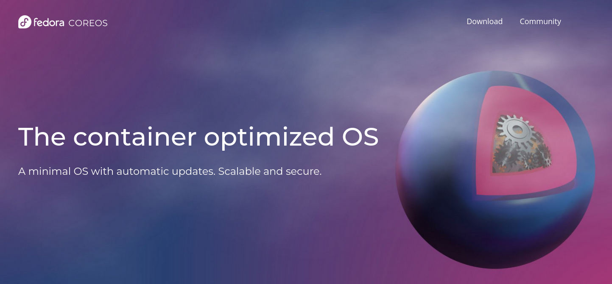
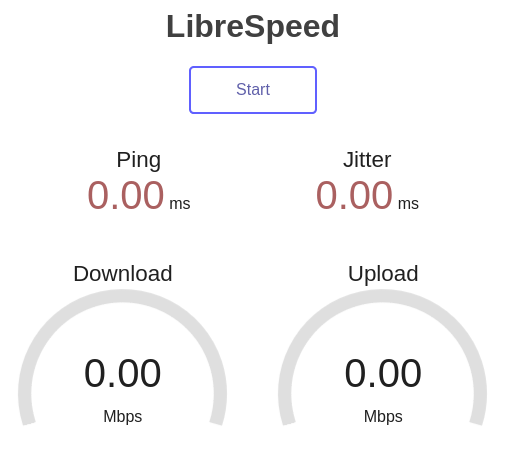
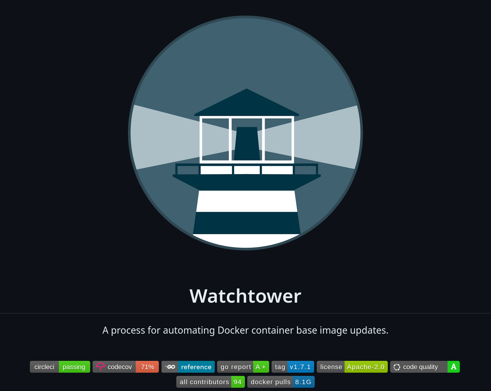
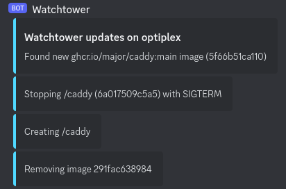
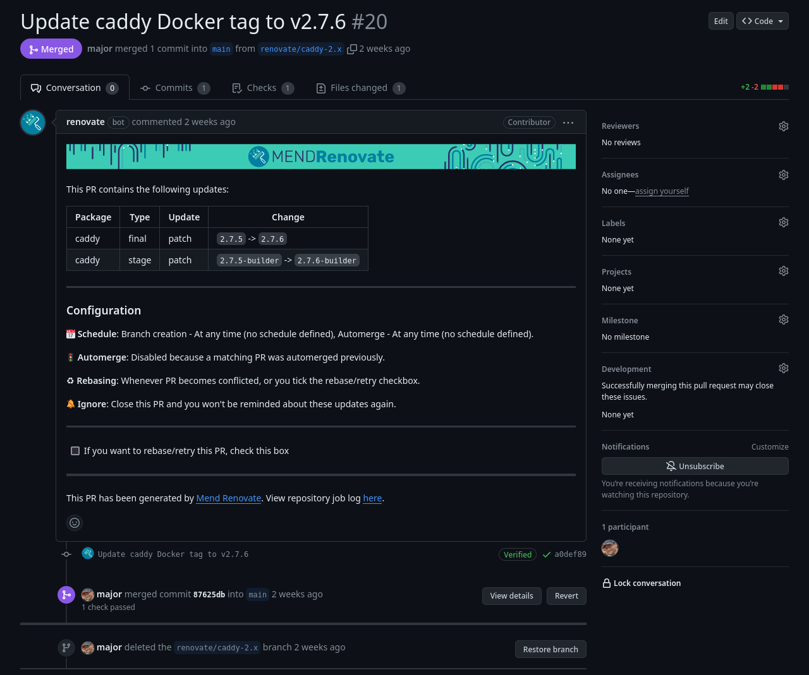
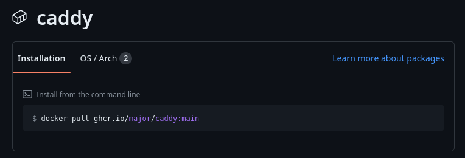
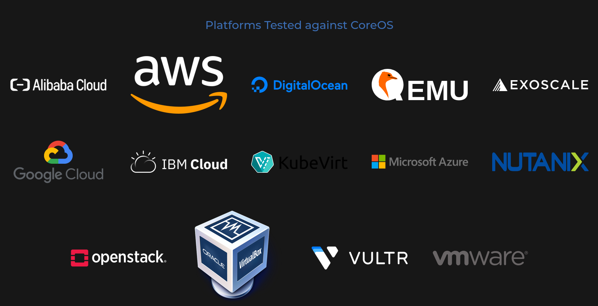

## Automated container updates with GitHub and CoreOS

* * *

Texas Linux Fest 2024

[Major Hayden](https://major.io/)

----

### First time using reveal.js!

> If something breaks,<br>please don't laugh **too** loudly.

🤭

----

## Why am I doing this talk?

My excitement and enthusiasm around containers<bR>_cannot be contained._

# 🫣

----

## My goals today

🥳 Make you excited about containers and CoreOS <!-- .element: class="fragment" -->

️♻️ Show how to keep container deployments<br>updated for (almost) free <!-- .element: class="fragment" -->

📚 Point to resources for more learning <!-- .element: class="fragment" -->

💸 Do everything on a tiny budget <!-- .element: class="fragment" -->

----

## Have questions?

I love questions. 💕

I promise I'll save time<br>for questions at the end!

----

## Who am I?

Worked in tech for 20 years <!-- .element: class="fragment" -->

Currently focused on RHEL in the public cloud <!-- .element: class="fragment" -->

Traveled down technical and manager career tracks <!-- .element: class="fragment" -->

Survived a period of time in information security <!-- .element: class="fragment" -->

Owner of too many domain names <!-- .element: class="fragment" -->

----

🤫<br>Please don't give me any ideas<br>for more domain names.

(My wife thanks you in advance.)

💕

---

## What are containers<br>and why do they exist?

----

## Containers are:

A method for separating workloads<br>on the same server <!-- .element: class="fragment" -->

Using the same kernel as the host <!-- .element: class="fragment" -->

Kept within CPU, memory,<br>and other limits you specify <!-- .element: class="fragment" -->

Shipped as images (tarballs) <!-- .element: class="fragment" -->

----

## Containers are:

Very fast when starting up

At the core of Kubernetes and OpenShift

Great for desktops, laptops,<br>cloud instances and servers

Easily signed with [cosign](https://github.com/sigstore/cosign) for integrity checking

----

## Containers are not:

Virtual machines <!-- .element: class="fragment" -->

A replacement for virtual machines  <!-- .element: class="fragment" -->

Good for every application <!-- .element: class="fragment" -->

----

## Containers usually have:

A basic userspace from an OS <!-- .element: class="fragment" -->

Additional OS packages or<br>language-specific packages/modules <!-- .element: class="fragment" -->

Your application <!-- .element: class="fragment" -->

Initial startup instructions <!-- .element: class="fragment" -->

Note:
Configuration NOT included.

----

## Building containers

```dockerfile
# Start from an existing base container
FROM docker.io/library/python:latest

# Copy in the application
COPY my_app.py /app

# Add some extra Python modules
RUN pip install flask

# Run the application when the container starts
ENTRYPOINT ["/app/my_app.py"]
```

----

# Time out

 <!-- .element: height="350em" -->

----

## ⚠️ Warning ⚠️

Always build your container from an image<br>that you trust and have verified.

You are bringing that base image into<br>contact with your application and its data.

----

### What do containers have to do with kubernetes?

I hear about kubernetes ***a lot.***

----

Kubernetes helps with orchestrating containers and other resources along with all of their dependencies.

----

Someone once said:

> "If you have a problem with containers, try kubernetes.
>
> Then you have two problems."

---

## What is CoreOS<br>and why does it exist?

* * *


----

The Fedora marketing team has<br> the most concise summary:



----

CoreOS lets you focus heavily on your container workloads
with much less focus on the OS itself.

----


Updates are atomic, much like an Android phone.

It's ready to run containers from the first boot.

Although you _can_ install packages in the OS,<br>you should use [toolbx](https://containertoolbx.org/) instead.

Goodbye, cloud-init. Hello, [ignition](https://coreos.github.io/ignition/)!

----

### Enough explanation!<br>Let's build stuff!

# 🚧 🏗️ 👷‍♂️

---

## The plan

* * *

1. Deploy a [librespeed](https://librespeed.org/) speed test server

2. Put the [caddy](https://caddyserver.com/) web server in front of it

3. [Connect caddy to Porkbun](https://major.io/p/caddy-porkbun/) to manage DNS records for certificates

4. Automated updates for all! 🎉

----

I'll use [docker-compose](https://github.com/docker/compose) for these examples,<br>
but you can also use [quadlets](https://major.io/p/quadlets-replace-docker-compose/)!


---

## Librespeed

A super basic speed test server

  <!-- .element: height="300em" -->

----

Start with a very basic docker-compose.yml file:

```yaml
services:
  librespeed:
    image: docker.io/adolfintel/speedtest
    container_name: librespeed
    environment:
      - MODE=standalone
    restart: unless-stopped
```

We're using the latest available librespeed container.

----

Librespeed is up and ready to go!

What about those updates?

# 🤔

---

Hello, watchtower!

  <!-- .element: height="500em" -->

----

[Watchtower](https://github.com/containrrr/watchtower) monitors for container
repository updates and keeps our containers updated locally.

```yaml
# Add to docker-compose.yaml under services
  watchtower:
    image: docker.io/containrrr/watchtower:latest
    container_name: watchtower
    volumes:
      - /var/run/docker.sock:/var/run/docker.sock
    restart: unless-stopped
    privileged: true
```

See my [watchtower blog post](https://major.io/p/watchtower/) for more details.

----

Watchtower optionally sends [notifications](https://containrrr.dev/watchtower/notifications/) for container updates, too.



----

Watchtower will keep our librespeed container updated, but we're missing a web server. 🤔

It's time to get our web server deployed.

---

## Caddy

Caddy gets TLS certificates for you automatically<br>via HTTP or DNS validation.

Caddy doesn't support Porkbun's DNS API,<br>
but there's a [plugin](https://github.com/caddy-dns/porkbun) for it. 🐷

We will need to build our own container<br>(and keep that build updated).

----

Container build file for Caddy

```docker
# Use the base caddy image with build tools
FROM caddy:2.7.6-builder AS builder

# Build the Porkbun plugin
RUN xcaddy build \
    --with github.com/caddy-dns/porkbun

# Copy over our newly built caddy to a fresh container
# (Makes container images smaller)
FROM caddy:2.7.6
COPY --from=builder /usr/bin/caddy /usr/bin/caddy
```

[major/caddy on GitHub](https://github.com/major/caddy)

----

A GitHub Actions [workflow](https://github.com/major/caddy/blob/main/.github/workflows/docker-publish.yml) builds the container,<br>
but how do we update to new caddy versions when they're available?


[Renovate](https://www.mend.io/renovate/) watches for updates and makes pull requests automatically.

----



----

GitHub serves the container images:



----

### Our customized caddy container:

Builds in GitHub Actions

Is served to the world via GitHub packages

Gets PRs automatically from Renovate for updates

----

## Auto-merge is possible!

I'm not using it yet, but you can allow Renovate to automatically merge these updates if your CI succeeds.

I prefer to review these for now.

----

Add a new service for Caddy:

```yaml
# Add under services in docker-compose.yml
  caddy:
    image: ghcr.io/major/caddy:main
    container_name: caddy
    ports:
      - 80:80
      - 443:443
    restart: unless-stopped
    volumes:
      - ./caddy/Caddyfile:/etc/caddy/Caddyfile:Z
      - caddy_data:/data
      - caddy_config:/config
```

----

Add two volumes for Caddy:

```yaml
# Add at the bottom of docker-compose.yml
volumes:
  caddy_data:
  caddy_config:
```

👍 These are important for holding the TLS certificate data! <!-- .element: class="smaller" -->

----

Build a Caddy configuration file:

```caddy
{
    email me@example.com
    acme_dns porkbun {
        api_key pk1_KEY
        api_secret_key sk1_KEY
    }
}

example.com {
    reverse_proxy librespeed:80
}
```

Place this in `./caddy/Caddyfile`

----

Just a few last things to do:

```bash
# Ensure our containers start on reboot.
sudo systemctl enable --now docker.service

# Add our user (core by default) to the docker group
sudo usermod --append --groups docker core

# Allow user processes (our containers) to "linger"
# if we log out
loginctl enable-linger core
```

----

## Time to shine!

```bash
docker-compose up --detach 
```

---

Let's recap each step we've done here:

----

## Caddy

Renovate watches for new caddy versions and sends us a pull request for updates

GitHub builds the caddy container in a workflow

GitHub serves the caddy container<br>
for machines to pull it

----

## Watchtower

Watches for new versions of our custom caddy container as well as librespeed

Pulls the new, updated containers<br>
down to our CoreOS host

Restarts the container automatically

----

## CoreOS

Pulls new base OS updates on a regular interval

Reboots itself into the updated version

Reverts to the previous revision if the boot fails

----

The only cost so far is a machine to run CoreOS.

# 😉

----

You have plenty of deployment choices:

 <!-- .element: height="300em" -->

(including that old machine under your desk) 😜 <!-- .element: class="smaller" -->

----

## Final thoughts

----

# 🛡️

Since you're updating containers automatically,<br>
ensure your container updates<br>
come from a reliable source!

(Or build and host the containers yourself!) <!-- .element: class="smaller" -->

----

# 🩺

Add external monitoring or health checks<br>
via docker-compose to know if an<br>
update caused a problem.

----

# 🚚

Make backups frequently!<br>

New containers often have database migrations included and when those don't work, it's a long day.

---

# Thank you! 💕

----

<div class="container">
<div class="col">
Major Hayden

major@mhtx.net

[major.io](https://major.io)
</div>

<div class="col">

 <!-- .element width="300px" -->

Get the slides here 👆

[txlf24-containers.major.io](https://txlf24-containers.major.io)

</div>
</div>


<!-- fun stylesheet stuff here 🎉 -->
<style type="text/css">
.smaller {
    font-size: 0.5em;
}
.container{
    display: flex;
    height: 100%;
    align-items: center;
    justify-content: center;
}
.col{
    flex: 1;
}
</style>
